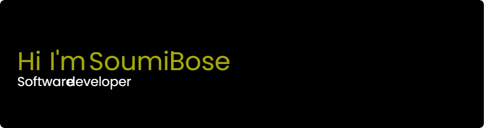

# Soumil Bose

A Software Developer / Applied Machine Learning Engineer at [Clipboard](https://www.clipboard.com/)

## Operating Systems

## Core Stack

## Machine Learning

## Cloud & Platforms

## Tools

## Social

<!---
soumil0507/soumil0507 is a ✨ special ✨ repository because its `README.md` (this file) appears on your GitHub profile.
You can click the Preview link to take a look at your changes.
--->
